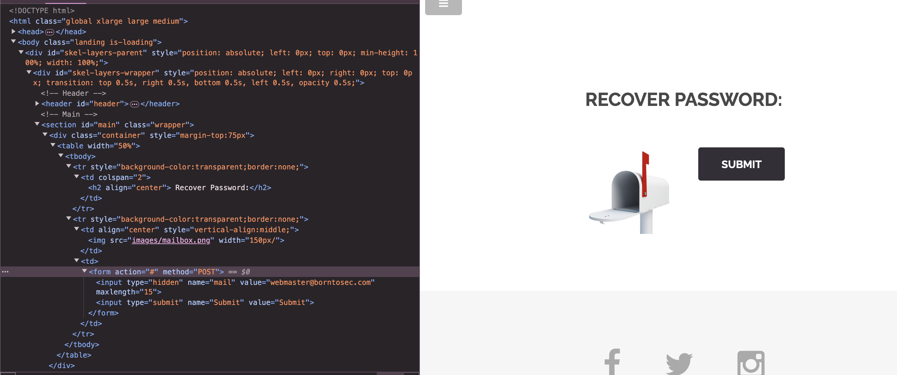

# Hidden Input / Gizli Girdi

Bu proje, HTML formlarında gizli giriş alanlarıyla çalışmayı içerir. Gizli girişler, kullanıcı tarafından görünmemesi veya düzenlenmemesi gereken verileri depolamak için kullanılır.



## Amaç

Bu projenin amacı, gizli girişlerin verileri kullanıcıya göstermeden istemci ve sunucu arasında nasıl iletilebileceğini anlamaktır.

## Örnek

İşte bir HTML formunda gizli bir giriş alanının basit bir örneği:

```html
<form action="#" method="POST">
    <input type="hidden" name="mail" value="webmaster@borntosec.com" maxlength="15">
    <input type="submit" name="Submit" value="Submit">
</form>
```

Bu örnekte, `mail` değeri form gönderildiğinde sunucuya gönderilir, ancak kullanıcıya görünmez.

## Kullanım Durumları

- Oturum belirteçlerini depolama
- Kullanıcı kimliklerini iletme
- Durum bilgilerini takip etme

## Güvenlik Hususları

Gizli girişler kullanıcılar tarafından görünmese de, tarayıcı geliştirici araçları aracılığıyla manipüle edilebilir. Güvenliği sağlamak için her zaman verileri sunucu tarafında doğrulayın ve temizleyin.

## Sonuç

Gizli girişler, geliştiricilerin verileri kullanıcıya göstermeden iletmesi için kullanışlı bir araçtır. Ancak, dikkatli kullanılmalı ve uygun güvenlik önlemleri alınmalıdır.

