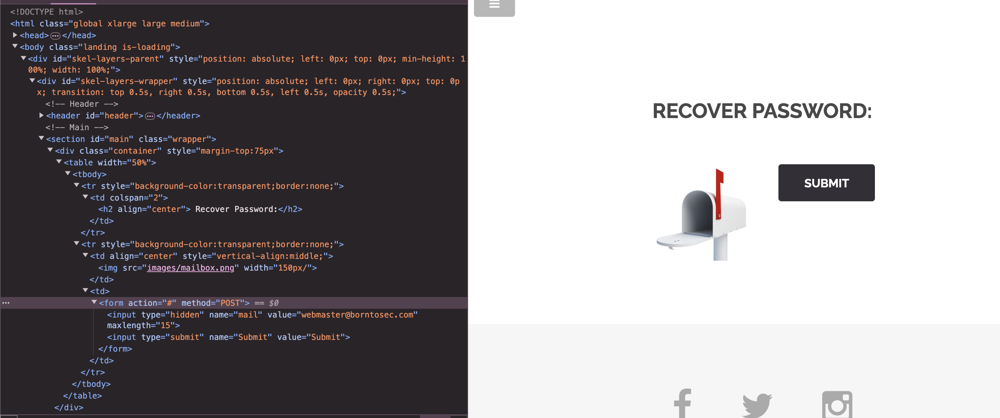

# Hidden Input / Gizli Girdi

This project involves working with hidden input fields in HTML forms. Hidden inputs are used to store data that should not be visible or editable by the user.



## Purpose

The purpose of this project is to understand how hidden inputs can be used to pass data between the client and server without displaying it to the user.

## Example

Here is a simple example of a hidden input field in an HTML form:

```html
<form action="#" method="POST">
    <input type="hidden" name="mail" value="webmaster@borntosec.com" maxlength="15">
    <input type="submit" name="Submit" value="Submit">
</form>
```

In this example, the `mail` value is sent to the server when the form is submitted, but it is not visible to the user.

## Use Cases

- Storing session tokens
- Passing user IDs
- Keeping track of state information

## Security Considerations

While hidden inputs are not visible to users, they can still be manipulated through browser developer tools. Always validate and sanitize data on the server side to ensure security.

## Conclusion

Hidden inputs are a useful tool for web developers to pass data without displaying it to users. However, they should be used with caution and proper security measures.

