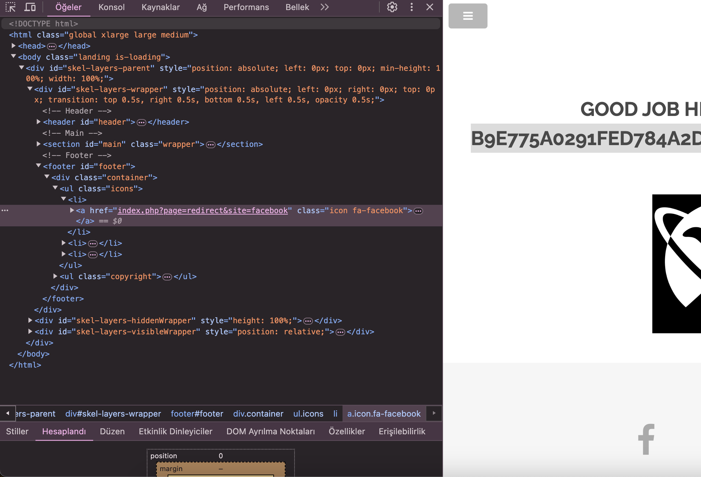

# Redirection / Yönlendirme
This project involves working with redirection in web applications. Redirection is used to navigate users to different pages or external sites.



## Purpose

The purpose of this project is to understand how redirection can be used to navigate users to different pages or external sites.

## Example

Here is a simple example of redirection in an HTML page:

```html
<ul class="icons">
    <li><a href="index.php?page=redirect&amp;site=facebook" class="icon fa-facebook"></a></li>
    <li><a href="index.php?page=redirect&amp;site=twitter" class="icon fa-twitter"></a></li>
    <li><a href="index.php?page=redirect&amp;site=instagram" class="icon fa-instagram"></a></li>
</ul>
```

In this example, clicking on the icons will redirect the user to the specified social media sites.

## Use Cases

- Navigating to external sites
- Redirecting after form submission
- Handling outdated URLs

## Security Considerations

While redirection is useful, it can be exploited for phishing attacks. Always validate and sanitize URLs to ensure security.

## Conclusion

Redirection is a useful tool for web developers to navigate users to different pages or external sites. However, it should be used with caution and proper security measures.
