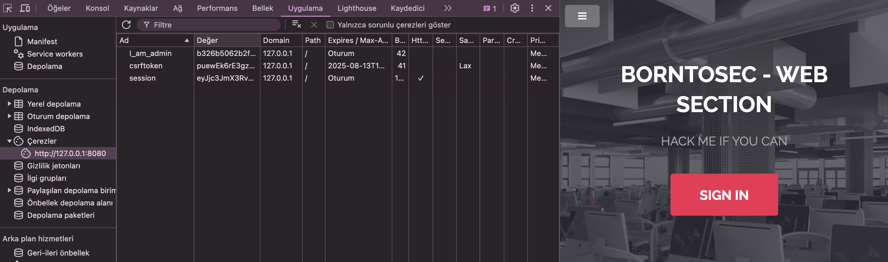

# Cookie Tampering

Bu proje, web uygulamalarında çerez güvenliği ve cookie tampering konularını içerir. Cookie tampering, bir saldırganın web uygulamalarındaki çerezleri değiştirerek yetkisiz erişim sağlamasına dayanan bir saldırı yöntemidir.



## Amaç

Bu projenin amacı, çerez tabanlı kimlik doğrulama mekanizmalarının nasıl çalıştığını ve cookie tampering saldırılarına karşı nasıl koruma sağlanabileceğini anlamaktır.

## Cookie Tampering Nedir?

Cookie tampering (çerez kurcalama), bir saldırganın web uygulaması tarafından kullanılan çerezleri değiştirerek, yetkisiz erişim kazanmaya çalıştığı bir siber saldırı türüdür. Saldırgan, çerezlerin içeriğini manipüle ederek, farklı kullanıcı olarak görünme veya yüksek yetkilere sahip olma gibi amaçlar güdebilir.

## Cookie Tampering Türleri

### Basit Değiştirme
- **Değer Manipülasyonu**: Çerez değerlerini doğrudan değiştirerek yetkisiz erişim kazanma
- **Rol Değiştirme**: Kullanıcı rolünü belirten çerezleri değiştirerek yetki yükseltme

### Gelişmiş Teknikler
- **Hash Değiştirme**: Hashlenmiş değerleri başka değerlerle değiştirme
- **Şifrelenmiş Çerezleri Kırma**: Zayıf şifrelenmiş çerezleri kırma ve değiştirme

### Araçlar ve Yöntemler
- Tarayıcı geliştirici araçları
- Proxy yazılımları (Burp Suite, OWASP ZAP)
- Tarayıcı eklentileri

## Örnek

İşte JavaScript'te bir çerez ayarlamanın basit bir örneği:

```javascript
// Bir çerez ayarla
document.cookie = 'I_am_admin=b3d8e3397dd58186292b9e6e4e99f391';
```

Çerezdeki ikinci değer `b3d8e3397dd58186292b9e6e4e99f391` bir MD5 hash gibi görünmektedir. MD5 (Message-Digest Algorithm 5), 128-bit (16-byte) hash değeri üreten ve genellikle 32 karakterlik onaltılık sayı olarak temsil edilen yaygın bir kriptografik hash fonksiyonudur.

Örneğinizde:

- `I_am_admin`: Muhtemelen kullanıcı rolünü veya kullanıcı adını temsil eder.
- `b3d8e3397dd58186292b9e6e4e99f391`: Bu, `true` kelimesinin MD5 hash'i.

Doğrulamak için, `true` kelimesini bir MD5 hash aracı veya fonksiyonu kullanarak hashleyebilirsiniz. İşte `true` için sonuç:

```plaintext
MD5("true") = b3d8e3397dd58186292b9e6e4e99f391
```

Bu, ikinci değerin `true` kelimesinin MD5 hash'i olduğunu gösterir.

## Cookie Tampering'e Karşı Korunma

### Güvenlik Önlemleri

1. **Çerez Güvenliği**:
   - HttpOnly bayrağını kullanarak JavaScript erişimini engelleyin
   - Secure bayrağını kullanarak HTTPS üzerinden iletim sağlayın
   - SameSite özelliğini yapılandırın

2. **Doğrulama ve İmzalama**:
   - Çerezleri imzalayarak değişiklikleri tespit edin
   - İstemci tarafında alınan çerezleri server tarafında doğrulayın
   - HMAC gibi güçlü doğrulama mekanizmaları kullanın

3. **Şifreleme**:
   - Hassas verileri çerezlerde şifrelenmiş şekilde saklayın
   - Zayıf şifreleme algoritmalarından kaçının

4. **İki Faktörlü Kimlik Doğrulama (2FA)**:
   - Kritik işlemler için ek doğrulama isteyin
   - Yalnızca çerez tabanlı kimlik doğrulamaya güvenmeyin

### Saldırı Tespit Yöntemleri

- Çerezlerin beklenmedik değişikliklerini izleyin
- Anormal davranışları tespit edin (rol değişiklikleri, yetkisiz erişim girişimleri)
- Günlükleme ve izleme sistemleri kurun

## Yasal Düzenlemeler

Web uygulamaları, GDPR ve KVKK gibi düzenlemeler uyarınca:
- Kullanıcı verilerini korumak için yeterli güvenlik önlemleri almalı
- Veri ihlallerini ilgili makamlara bildirmeli
- Kullanıcıları çerez güvenliği konusunda bilgilendirmeli

## Sonuç

Cookie tampering, web uygulamalarında ciddi bir güvenlik tehdididir. Geliştiriciler, güvenli çerez yapılandırmaları, imzalama, şifreleme ve uygun doğrulama mekanizmaları kullanarak bu tür saldırılara karşı koruma sağlamalıdır. Modern web uygulamalarında güvenli çerez yönetimi, başarılı bir kullanıcı deneyimi ve veri güvenliği için kritik öneme sahiptir.
