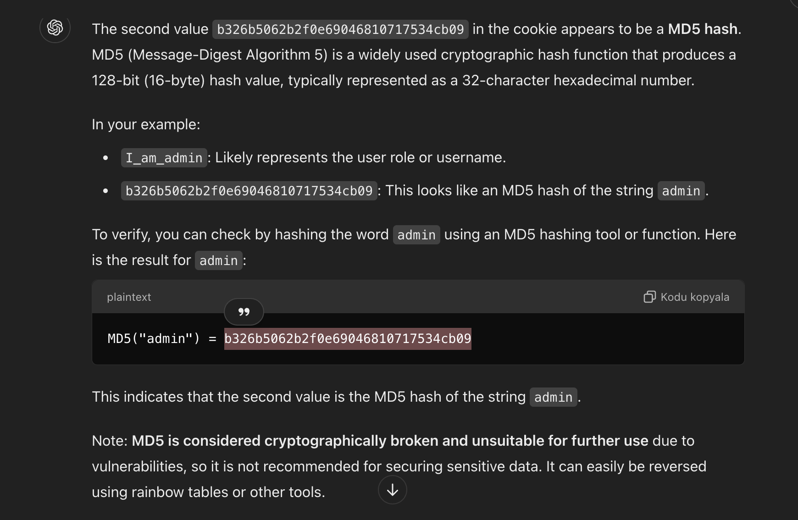

# Cookies / Çerezler
Bu proje, web uygulamalarında çerezlerle çalışmayı içerir. Çerezler, kullanıcıları izlemek ve tanımlamak için istemcinin tarayıcısında veri depolamak için kullanılır.




## Amaç

Bu projenin amacı, çerezlerin istemcinin tarayıcısında nasıl veri depolamak için kullanılabileceğini ve güvenli bir şekilde nasıl yönetilebileceğini anlamaktır.

## Örnek

İşte JavaScript'te bir çerez ayarlamanın basit bir örneği:

```javascript
// Bir çerez ayarla
document.cookie = 'I_am_admin=b326b5062b2f0e69046810717534cb09';
```

Çerezdeki ikinci değer `b326b5062b2f0e69046810717534cb09` bir MD5 hash gibi görünmektedir. MD5 (Message-Digest Algorithm 5), 128-bit (16-byte) hash değeri üreten ve genellikle 32 karakterlik onaltılık sayı olarak temsil edilen yaygın bir kriptografik hash fonksiyonudur.

Örneğinizde:

- `I_am_admin`: Muhtemelen kullanıcı rolünü veya kullanıcı adını temsil eder.
- `b326b5062b2f0e69046810717534cb09`: Bu, `admin` kelimesinin MD5 hash'i gibi görünüyor.

Doğrulamak için, `admin` kelimesini bir MD5 hash aracı veya fonksiyonu kullanarak hashleyebilirsiniz. İşte `admin` için sonuç:

```plaintext
MD5("admin") = b326b5062b2f0e69046810717534cb09
```

Bu, ikinci değerin `admin` kelimesinin MD5 hash'i olduğunu gösterir.

## Güvenlik Hususları

Not: MD5, kriptografik olarak kırılmış ve güvenlik açıkları nedeniyle daha fazla kullanım için uygun değildir, bu nedenle hassas verileri güvence altına almak için önerilmez. Rainbow tabloları veya diğer araçlar kullanılarak kolayca tersine çevrilebilir.

## Sonuç

Çerezler, web geliştiricileri için istemcinin tarayıcısında veri depolamak için yararlı bir araçtır. Ancak, dikkatli ve uygun güvenlik önlemleri ile kullanılmalıdır.
