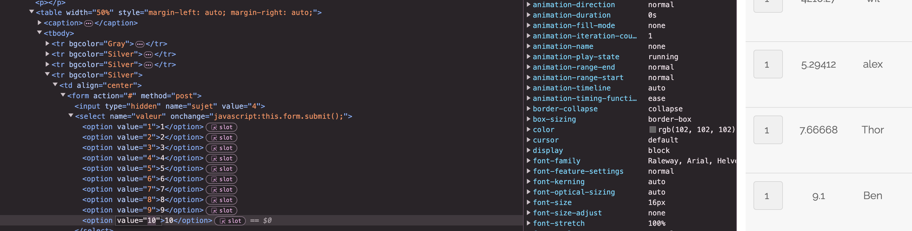

# Tampering Attack in Survey Voting

Anket sayfasında kullanıcılar seçtikleri kişi için 1 ile 10 arasında puan ekleyebilirler. Ancak, sayfanın koduna yakından bakarsak, aşağıdaki durumu gözlemleyebiliriz:



## Kod Örneği

İlgili HTML kodu aşağıdadır:

```html
<td align="center">
    <form action="#" method="post">
        <input type="hidden" name="sujet" value="2">
        <select name="valeur" onchange="javascript:this.form.submit();">
            <option value="1">1</option>
            <option value="2">2</option>
            <option value="3">3</option>
            <option value="4">4</option>
            <option value="5">5</option>
            <option value="6">6</option>
            <option value="7">7</option>
            <option value="8">8</option>
            <option value="9">9</option>
            <option value="10">10</option>
        </select>
    </form>
</td>
```

 `option` etiketlerinin `value` özniteliğini istediğimiz gibi değiştirebiliriz. Böylece, Thor'a 651665195 eklersek ve onu seçersek flag ı elde ediyoruz.

## Bunu Nasıl Önleriz?

Bunu önlemek için, kullanıcının eklemek istediği değeri sunucu tarafında (back-end) kontrol etmelisiniz. Bu durumda, değer kesinlikle 1 ile 10 arasında olmalıdır!

### Sunucu Tarafı Doğrulama Örneği

İşte PHP kullanarak değeri sunucu tarafında nasıl doğrulayabileceğinize dair bir örnek:

```php
<?php
if ($_SERVER["REQUEST_METHOD"] == "POST") {
    $value = intval($_POST['valeur']);
    if ($value >= 1 && $value <= 10) {
        // Oyu işle
        echo "Oy kabul edildi!";
    } else {
        // Geçersiz oy değeri
        echo "Geçersiz oy değeri!";
    }
}
?>
```

Bu örnekte, oy işlenmeden önce değerin 1 ile 10 arasında olup olmadığı kontrol edilir.

## Sonuç

Oy değerini sunucu tarafında doğrulayarak, kullanıcıların oy değerlerini manipüle etmelerini önleyebilir ve adil bir oylama sağlayabilirsiniz.
