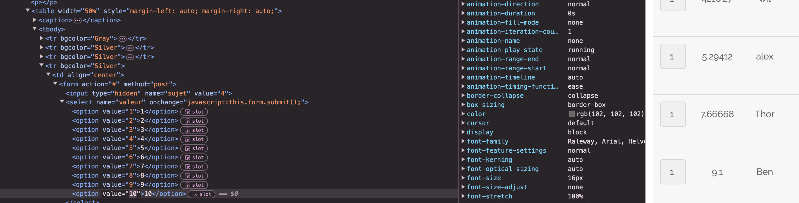

# Survey Voting Cheat / Anket Oylama Hilesi
In the survey page, users can vote for Laurie, Mathieu, Thor, Ly, and Zaz. The purpose of the vote is not explained, so let's assume we are voting for the person with the best shoelaces. Users can add between 1 to 10 points for their chosen person. However, if we look closely at the page's code, we can observe the following:



## Code Example

Here is the relevant HTML code:

```html
<td align="center">
    <form action="#" method="post">
        <input type="hidden" name="sujet" value="2">
        <select name="valeur" onchange="javascript:this.form.submit();">
            <option value="1">1</option>
            <option value="2">2</option>
            <option value="3">3</option>
            <option value="4">4</option>
            <option value="5">5</option>
            <option value="6">6</option>
            <option value="7">7</option>
            <option value="8">8</option>
            <option value="9">9</option>
            <option value="10">10</option>
        </select>
    </form>
</td>
```

These lines are repeated for each person we want to vote for. However, we can modify the `value` attribute of the `option` tags as we wish. Thus, I can add 651665195 points to Thor to make him the top of the leaderboard! (I didn't actually do the math, but the idea is there).

## How to Prevent This?

To prevent this, you should check the value that a user wants to add on the server side (back-end). In this case, it's easy: the value must be strictly between 1 and 10!

### Example of Server-Side Validation

Here is an example of how you can validate the value on the server side using PHP:

```php
<?php
if ($_SERVER["REQUEST_METHOD"] == "POST") {
    $value = intval($_POST['valeur']);
    if ($value >= 1 && $value <= 10) {
        // Process the vote
        echo "Vote accepted!";
    } else {
        // Invalid vote value
        echo "Invalid vote value!";
    }
}
?>
```

In this example, the value is checked to ensure it is between 1 and 10 before processing the vote.

## Conclusion

By validating the vote value on the server side, you can prevent users from manipulating the vote values and ensure fair voting.
