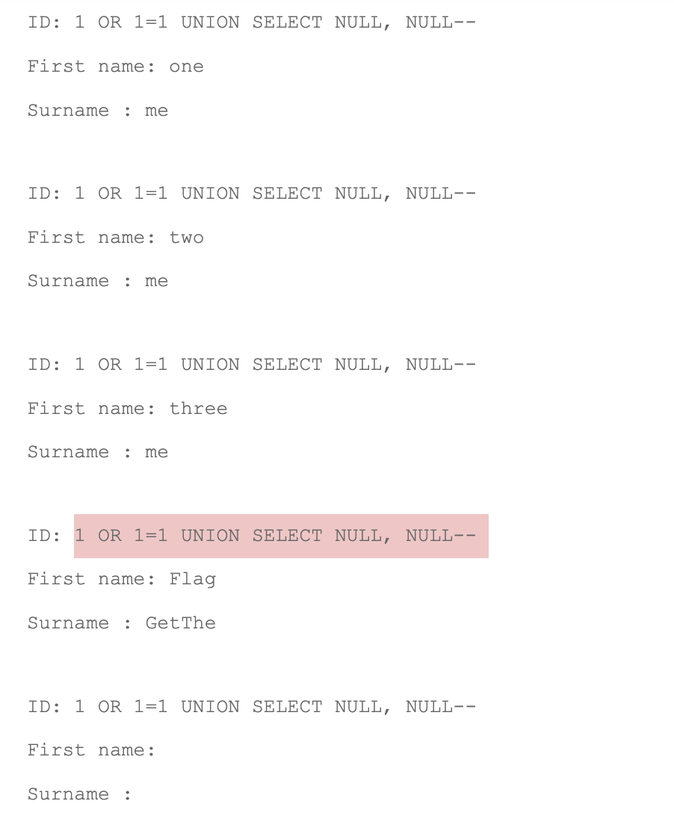
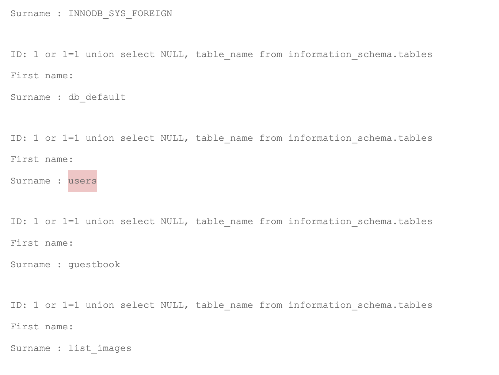
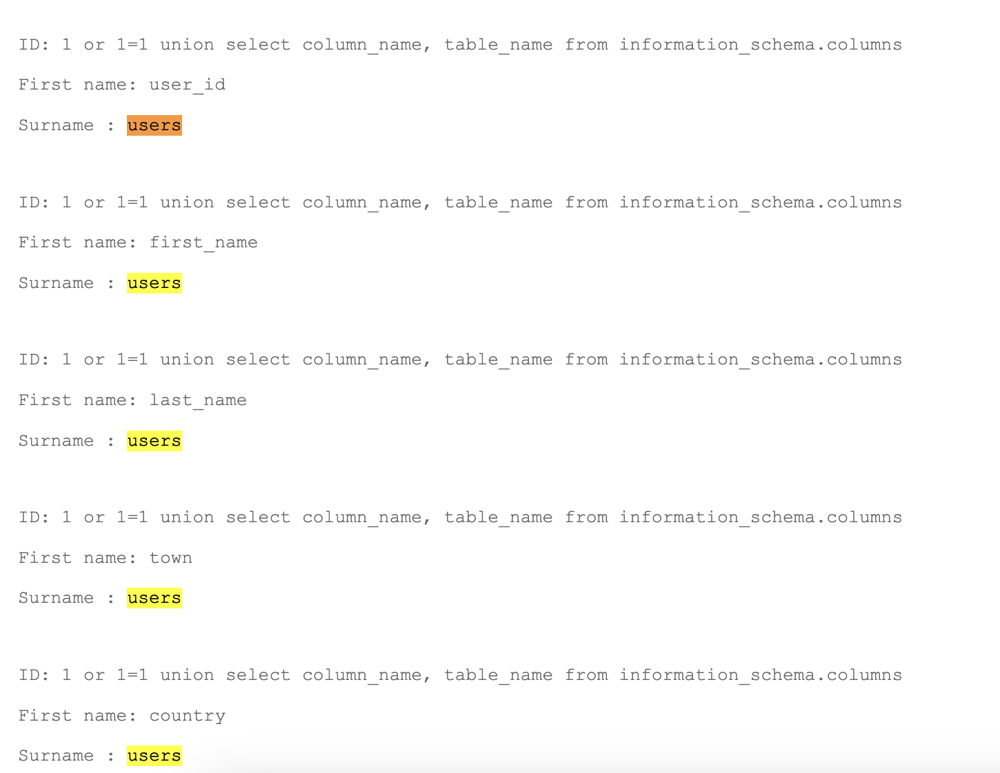
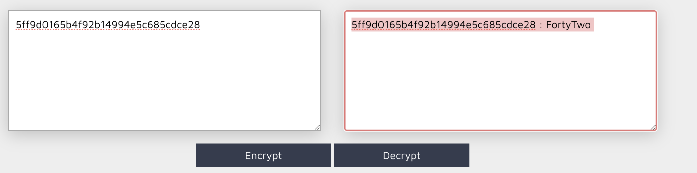
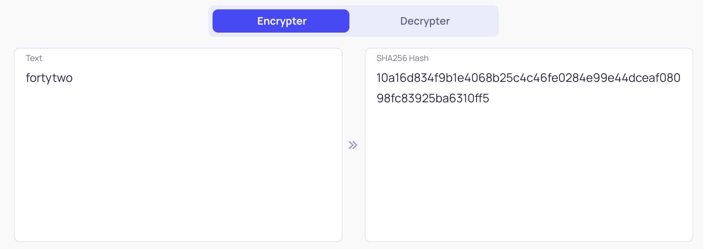

## Açıklama
Bu projede, bir üye arama özelliğinde SQL enjeksiyon açıklarını test ediyoruz.

## Yeniden Üretme Adımları

1. Aşağıdaki URL'ye gidin:
    ```
    http://localhost:8080/index.php?page=member&id=1'&Submit=Submit#
    ```

    ID: 1 
    Ad: one
    Soyad: me

2. Bu SQL Enjeksiyon Kodunu deneyin:
    ```
    SELECT * FROM users
    ```

    - Bu hatayı alırsınız: SQL sözdiziminizde bir hata var; MariaDB sunucu sürümünüze karşılık gelen kılavuzu kontrol edin ve 'SELECT * FROM users' satırında doğru sözdizimini kullanın.

3. Üstteki SQL enjeksiyon testimiz başarısız oldu. Şunu anlıyoruz ki eski bir SQL server üzerinde çalışıyoruz, yani eski bir SQL servera uygun sorgular yazmamız gerek. Birkaç arama yaptım ve şu siteye eriştim: [PortSwigger SQL Injection Union Attacks](https://portswigger.net/web-security/sql-injection/union-attacks). Buradan alttaki sorguyu test ettiğimde işe yaradığını fark ettim. Bu sorgu şunu yapıyor:
    ```
    1 OR 1=1 UNION SELECT NULL, NULL--
    ```
    - **Açıklama**: Bu sorgu klasik bir SQL enjeksiyon tekniği kullanır. `1 OR 1=1` kısmı her zaman doğru olarak değerlendirilir ve bu sayede herhangi bir koşul kontrolünü atlatır. `UNION SELECT NULL, NULL--` kısmı, orijinal sorguya başka bir sorgunun sonuçlarını eklemek için kullanılır. `--` ise SQL sunucusuna sorgunun geri kalanını yok saymasını söyleyen bir yorum göstergesidir. Bu sayede sorguyu manipüle ederek ek veri döndürmesini sağlarız. Burada "ek veri" ile kast edilen, orijinal sorgunun sonuçlarına ek olarak başka bir sorgunun sonuçlarını da döndürmektir. Örneğin, kullanıcı bilgilerini döndüren bir sorguya, veritabanındaki diğer bilgileri de ekleyebiliriz.
    - **Çıktı**: 

4. Üstteki SQL enjeksiyon sorgusu işimize epey yaradı. Şimdi ise başka bir SQL enjeksiyonu denememiz gerek. Kişileri listelettik ama veritabanı şeması hakkında elimizde hala bir bilgi yok. Hangi tablodan bize veri aktarıldığını bilmiyoruz. Bunu öğrenmenin ise bir sorgu yöntemi var:
    ```
    1 OR 1=1 UNION SELECT NULL, table_name FROM information_schema.tables
    ```
    Bu sorguyu nmap tooluna bakarken fark ettim. Klasik yetkilendirmeyi aşma ve yetkilendirme sonrası giden SQL sorgusunu manipüle edip onun yerine NULL dahi olsa tablo isimlerini `information_schema.tables` altından çekme.

    - **Açıklama**: `information_schema.tables`, SQL veritabanlarında mevcut olan tüm tabloların meta verilerini içeren özel bir sistem tablosudur. Bu tablo, veritabanındaki tüm tabloların adlarını ve diğer ilgili bilgileri saklar. `UNION SELECT NULL, table_name` kısmı, orijinal sorguya başka bir sorgunun sonuçlarını eklemek için kullanılır ve bu durumda `table_name` sütununu `information_schema.tables` tablosundan çeker. Bu sayede veritabanında hangi tabloların bulunduğunu öğrenebiliriz.
    - **Çıktı**: Bu sorgu çalıştırıldığında, veritabanında mevcut olan tüm tabloların isimlerini listeleyecektir. Bu bilgi, daha ileri SQL enjeksiyon saldırıları için kullanılabilir.

    Bu sorgu epey işimize yaradı aslına bakarsanız  resime baktığımızda sql sorgusunda ufak bir eksik olduğunu görüyoruz tablo isimlerini öğrendik güzel fakat tablo isimlerinin altında birde tablonun içerisindeki sütunların isimlerinide öğrenmeliyiz bu bize epey şey kazandıracak. O yüzden sorguda ufak bir değişiklik yapmaya karar verdim information_schema dediğimiz şey bize aslında db hakkında her şeyi sunuyor bakın sorguda ufak bir düzenleme yaparak column_name'i de elde edeceğiz `1 or 1=1 union select column_name, table_name from information_schema.columns`tek yapmamız gereken information_schema'ya bu sefer columns'ları istediğimi söylemekti.  bütün sütunların idlerini görmek güzeldi, şimdi işimize dönelim. Eminim ki aradığımız flag bu sütunların birinde saklı hatırlarsanız member_search bize sadece 3 şeyi sunuyordu id, firstname ve lastname bunlarda olmadığından eminiz o zaman diğerlerine bakmalıyız? 

    `1 or 1=1 union select user_id, CONCAT(town, country, planet, Commentaire, countersign) FROM users` işte o flag'i bulduran harika sql kodumuz aslında sütun isimlerine baktığımda countersign içerisinde olduğundan emindim ama hepsine bakmak eğlenceli gözüktü.  countersign içerisindeki md5'i decryptledik ve söylediği gibi  sha256 olarak encryptledik ve flage ulaşmış olduk.

