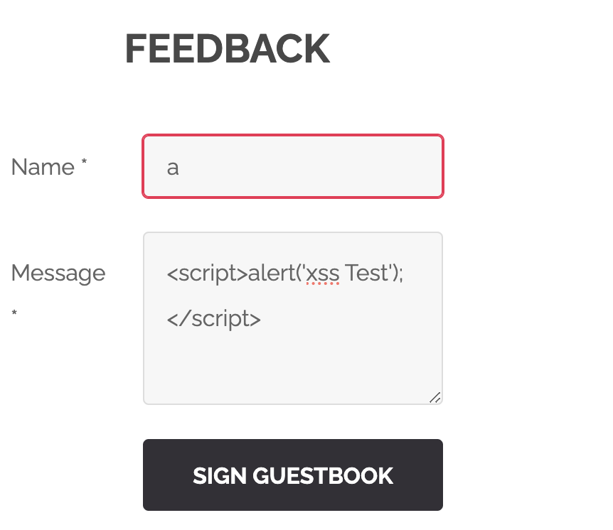

# XSS Saldırıları ve Flag Çözümleme

## XSS Saldırıları Nedir?
XSS (Cross-Site Scripting), bir saldırganın, bir web uygulamasına kötü niyetli kod enjekte etmesine olanak tanıyan bir güvenlik açığıdır. Bu saldırılar genellikle, kullanıcıların tarayıcılarında kötü niyetli JavaScript kodlarının çalıştırılmasına neden olur.

## Flag Çözümleme Adımları

### Adım 1: step1.png İncelemesi


Bu adımda, XSS açığını kullanarak belirli bir sayfaya kötü niyetli bir kod enjekte ediyoruz. Kullanılan basit XSS kodu: `<script>alert('xss Test');</script>`. Bu kod, flag.txt dosyasındaki veriyi elde etmemize yardımcı olacak.

### Adım 2: flag.txt Dosyasının İçeriği
```plaintext
0fbb54bbf7d099713ca4be297e1bc7da0173d8b3c21c1811b916a3a86652724e
```

Bu flag, XSS saldırısı sonucunda elde edilen veridir. Bu veriyi kullanarak, saldırının başarılı olduğunu ve gerekli bilgiyi elde ettiğimizi doğrulayabiliriz.

## Sonuç
XSS saldırıları, web uygulamalarında ciddi güvenlik açıklarına neden olabilir. Bu nedenle, kullanıcı girdilerinin doğru bir şekilde filtrelenmesi ve doğrulanması önemlidir.
